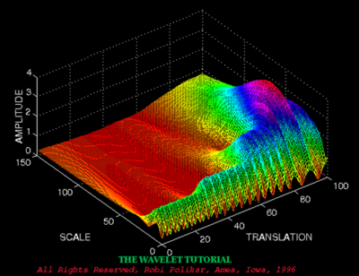
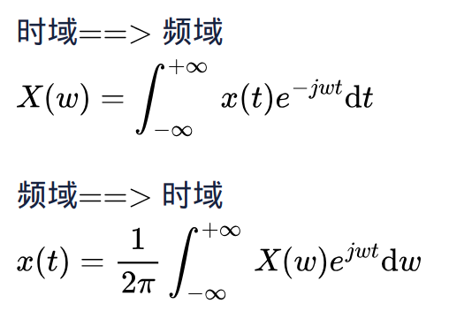
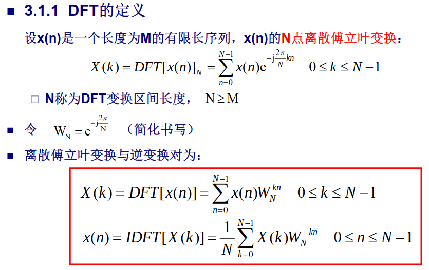

# 小波变换




## 从傅里叶变换开始

### 傅里叶变换介绍


**核心公式：**



**参考链接：**

[傅里叶分析之掐死教程（完整版）](https://zhuanlan.zhihu.com/p/19763358)

[傅里叶级数与傅里叶变换一](https://wzbtech.com/tech/fourier1.html)

[傅里叶级数与傅里叶变换二](https://wzbtech.com/tech/fourier2.html)

#### 离散傅里叶变换




DFT代码：

```python

import math
import cmath
import matplotlib.pyplot as plt
import numpy as np 


def dft(x):

    N = len(x)
    X = []
    for k in range(N):
        re = 0.0
        im = 0.0
        for n in range(N):
            phi = 2 * math.pi * k * n / N
            re += x[n] * math.cos(phi)
            im -= x[n] * math.sin(phi)
        re = re / N
        im = im / N
        X.append(complex(re, im))
    return X


# 生成测试信号
N = 64
f1 = 5  # 第一个正弦信号的频率
f2 = 10 # 第二个正弦信号的频率
x = [math.sin(2 * math.pi * f1 * n / N) + math.sin(2 * math.pi * f2 * n / N) for n in range(N)]


plt.figure()
plt.subplot(121)
plt.plot(x)
# plt.show()

# 计算傅里叶变换
X = dft(x)

dft_data = np.abs(np.array(X))
plt.subplot(122)
plt.plot(dft_data)
plt.show()
```

### 快速傅里叶变换
[快速傅里叶变换](./快速傅里叶变换.pdf)

[库利-图基快速傅里叶变换算法](./库利-图基快速傅里叶变换算法.pdf)

实例代码

```python

import math
import cmath
import matplotlib.pyplot as plt
import numpy as np 


def fft(x):
    N = len(x)
    print("N: ", N)
    if N <= 1:
        return x
    even = fft(x[0::2])
    
    # print("cal odd \n")
    
    odd =  fft(x[1::2])
    T= [cmath.exp(-2j*cmath.pi*k/N)*odd[k] for k in range(N//2)]
    return [even[k] + T[k] for k in range(N//2)] + [even[k] - T[k] for k in range(N//2)]

# 生成测试信号
N = 64
f1 = 5  # 第一个正弦信号的频率
f2 = 10 # 第二个正弦信号的频率
x = [math.sin(2 * math.pi * f1 * n / N) + math.sin(2 * math.pi * f2 * n / N) for n in range(N)]


plt.figure()
plt.subplot(121)
plt.plot(x)
# plt.show()

# 计算傅里叶变换
X = fft(x)

dft_data = np.abs(np.array(X))
plt.subplot(122)
plt.plot(dft_data)
plt.show()

```


## 小波变换

### 介绍
[小波变换（wavelet transform）知乎回答系列](https://www.zhihu.com/topic/19621077/top-answers)

[形象易懂讲解算法I——小波变换](https://zhuanlan.zhihu.com/p/22450818)

### 连续小波变换
[连续小波变换（CWT）](https://www.cnblogs.com/zhibei/p/9368575.html)

